# امتحانک

## معرفی

در دنیای امروز با فراگیر شدن آموزش آنلاین و تغییر در رویکردهای آموزشی، دبیران و دانش‌آموزان با
چالش‌های جدیدی روبرو هستند. **امتحانک** به وجود آمده تا این چالش‌ها را حل نماید. دبیران نیاز دارند
تا به راحتی سوالات خود را مدیریت کنند و از امکانات آموزش آنلاین به بهترین شکل بهره‌مند شوند. همچنین،
دانش‌آموزان نیاز به یک پلتفرم جامع دارند که امکانات پاسخ به سوالات و دسترسی به سوالات استاندارد را
در اختیار آنها قرار دهد. امتحانک با ترکیب این امکانات، به افراد این امکان را می‌دهد تا آموزش و
ارزیابی را بهبود بخشند و به صورت مؤثرتر در دنیای نوین آموزشی فعالیت کنند.

## ویژگی‌ها

- **مدیریت سوالات**: دبیران می‌توانند سوالات خود را به راحتی مدیریت و تنظیم کنند.
- **پاسخ‌دهی به سوالات**: دانش‌آموزان به راحتی به سوالات پاسخ دهند و نتایج خود را مشاهده کنند.
- **دسترسی به سوالات استاندارد**: امکان دسترسی به بانک سوالات استاندارد برای دانش‌آموزان.

## تصاویر

  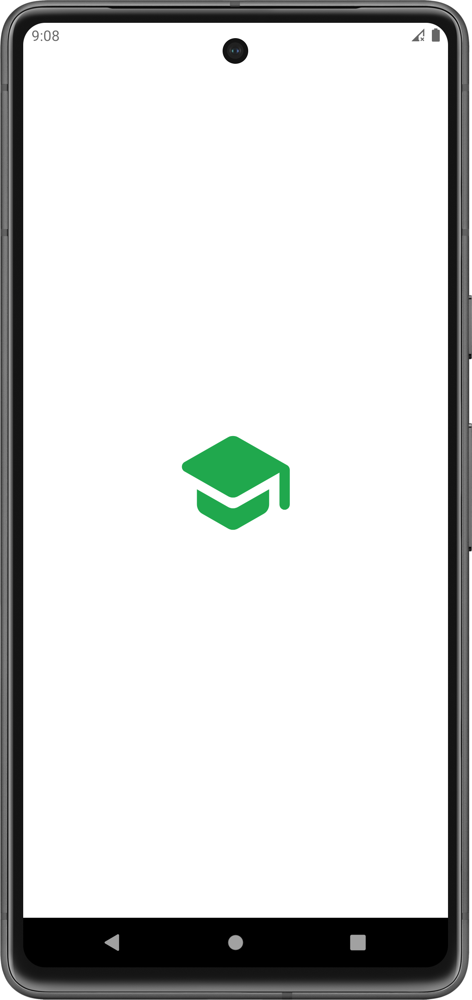
  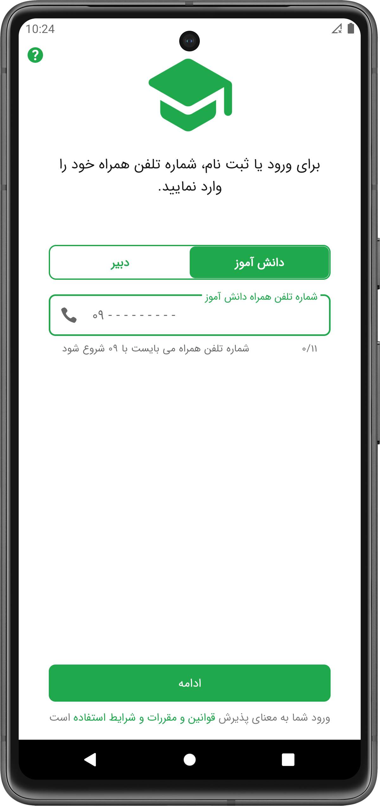
  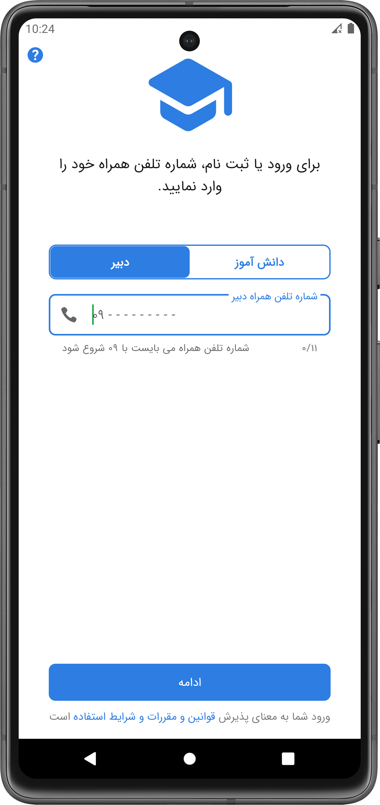
  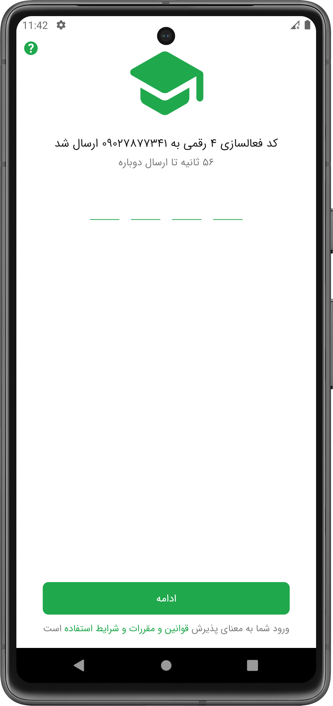
  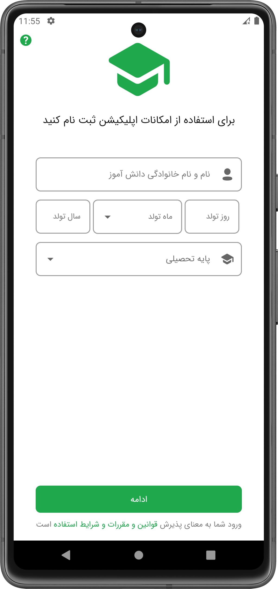
  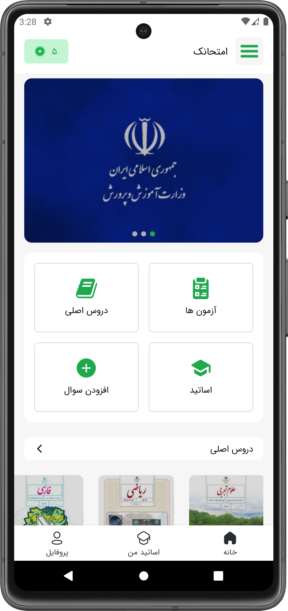
  
  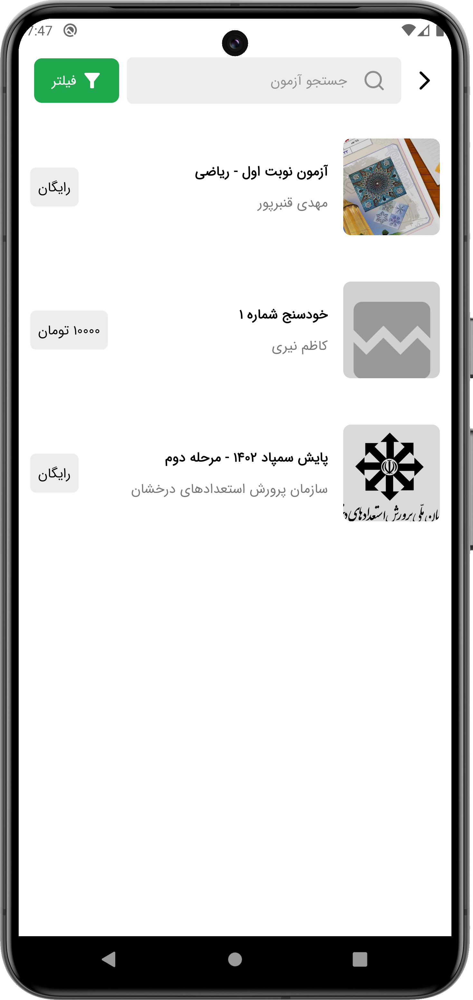
  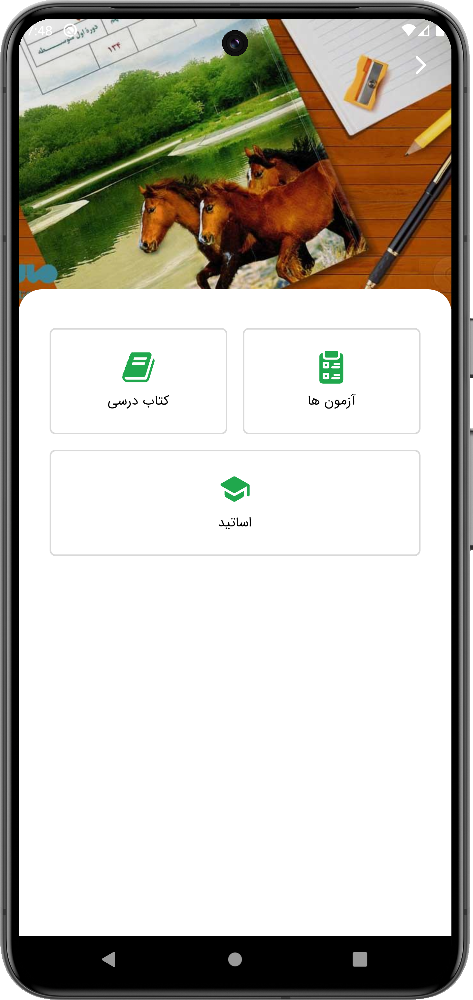
  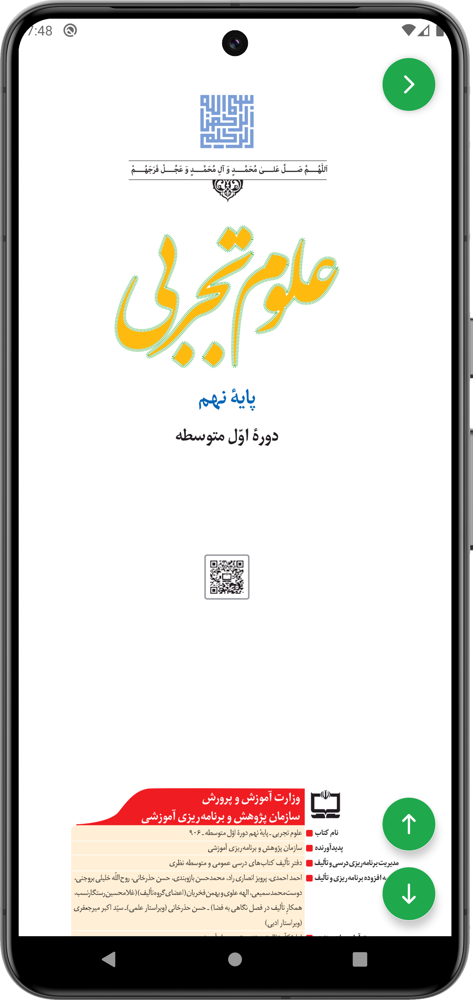
  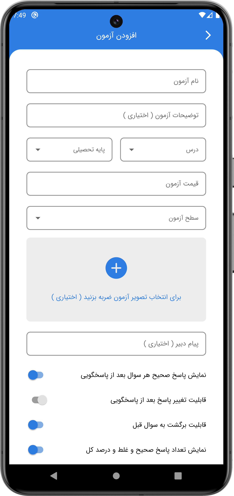
  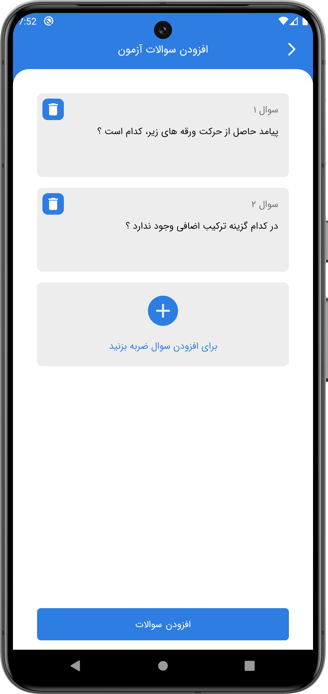
  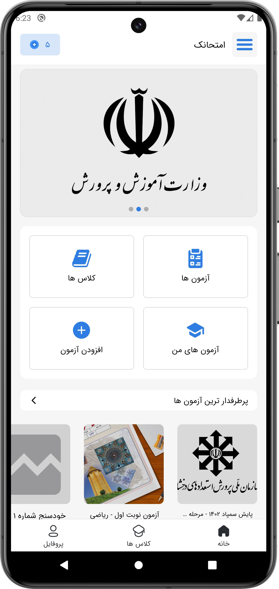
  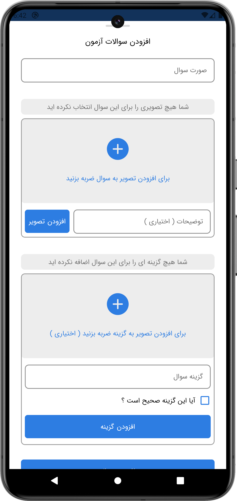
  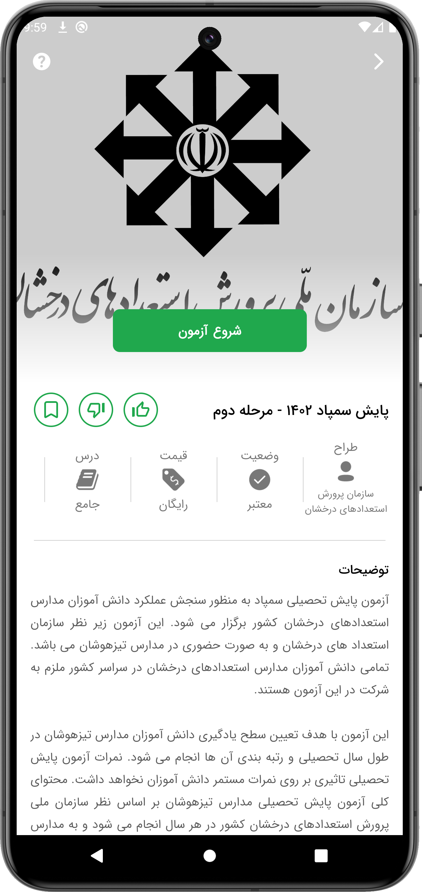
  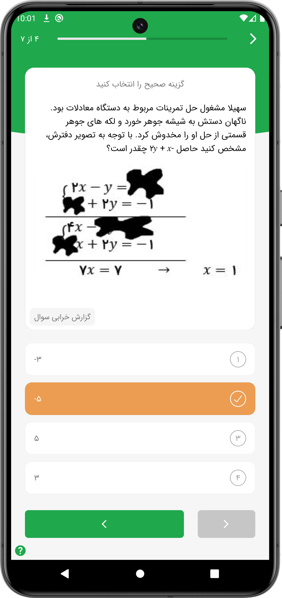
  

### کتابخانه‌ها و وابستگی‌ها

برخی از کتابخانه‌ها و ابزارهای مورد استفاده در این پروژه:

- [**Navigation Component**](https://developer.android.com/guide/navigation)
- [**Room**](https://developer.android.com/jetpack/androidx/releases/room)
- [**Gson**](https://github.com/google/gson)
- [**RxJava**](https://github.com/ReactiveX/RxJava)
- [**Koin**](https://github.com/InsertKoinIO/koin)
- [**Image Slideshow**](https://github.com/denzcoskun/ImageSlideshow)
- [**Glide**](https://github.com/bumptech/glide)
- [**Lottie**](https://github.com/airbnb/lottie-android)
- [**Retrofit**](https://github.com/square/retrofit)
- [**Spark Button**](https://github.com/varunest/SparkButton)
- [**OkHttp**](https://github.com/square/okhttp)
- [**PDF Viewer**](https://github.com/barteksc/AndroidPdfViewer)
- **Firebase Analytics**
- **Firebase Performance Monitoring**
- **Firebase Crashlytics**

## تیم توسعه‌دهنده

این اپلیکیشن توسط تیمی از دانش‌آموزان پایه نهم مدرسه شهید بهشتی بوشهر، **مهدی قنبرپور** و **سینا
دیندارلو**، طراحی و پیاده‌سازی شده است. این پروژه تحت نظر و هدایت **استاد علی زمردیان**، به عنوان
استاد راهنما، توسعه یافته است.

## تشکر ویژه

با تشکر ویژه از جناب آقای اتابک، جناب آقای قاسمی، جناب آقای غانمی زاده، جناب
آقای [پورمومن](https://github.com/alipourmomen) و باقی افرادی که ما را در ساخت این پروژه یاری
کرده‌اند.

